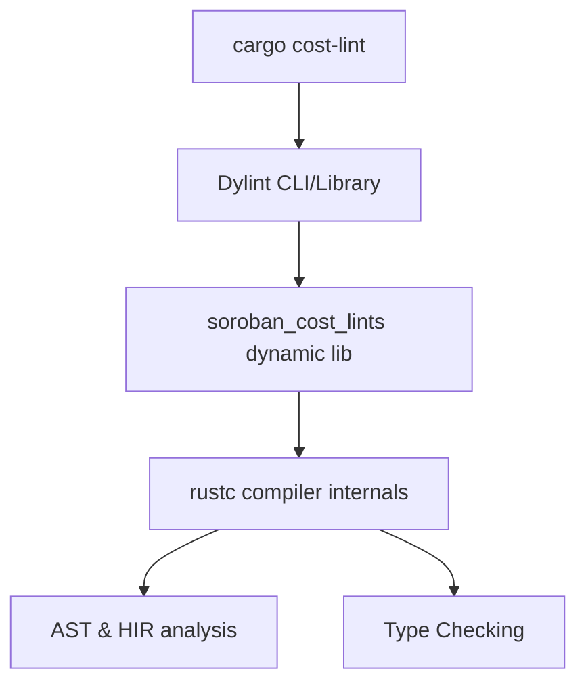

# MVP Roadmap: `soroban-cost-linter`

This document details the roadmap for developing a functional MVP of `soroban-cost-linter`, designed to statically catch input-independent, structurally expensive patterns in Soroban smart contracts.

---

## 1. Tooling & Architecture Selection

To avoid the fragility of regex or basic parsing, we will leverage **Dylint** to build and run dynamic library lints by hooking directly into the Rust compiler (`rustc`).



### Why Dylint over Custom Parser (`syn`)?
- **Type Safety / Resolution**: Using `syn` alone only allows syntax checking. It cannot definitively distinguish if a `storage` variable is of type `soroban_sdk::storage::Storage`. Dylint gives us full access to the High-Level Intermediate Representation (HIR) and type checker.
- **Suppression System**: Inherits standard `#[allow(...)]` attributes automatically.

---

## 2. Milestone 1: The First Lint

For the MVP, we will focus on one highly expensive, structurally clear anti-pattern as the first implemented lint.

### Selected First Lint: `soroban_storage_in_loop`
*   **Target Pattern**: Calling `env.storage().instance().set(...)` (or `get`, `has`, etc.) inside a `for`, `while`, or `loop` block.
*   **Cost Impact**: Storage operations are the most expensive resource in Soroban. Calling them in loops wastes CPU instructions and ledger write/read throughput.
*   **Lint Suggestion**: Suggest pulling the read/write out of the loop by accumulating mutations in memory (e.g., using a local `Map` or `Vec`) and executing a single storage operation after the loop.

### Future Lint Candidates (Milestone 2)
1.  **`redundant_env_clone`**: Flags calling `.clone()` on the `Env` object since it is designed to be passed cheaply by reference or copy value.
2.  **`unnecessary_host_function_call`**: Flags repeated calls to host functions (e.g., `env.ledger().sequence()`) inside loop bodies.

---

## 3. False-Positive Mitigation Strategy

Ensuring developer trust and minimizing friction is crucial for adoption.

### Suppression Mechanisms
- **Rust Attributes**: Developers can suppress warnings directly in code:
  ```rust
  #[allow(soroban_cost::storage_in_loop)]
  for item in items {
      // Deliberate storage loop
  }
  ```
- **Config file (`budget.toml`)**: Allows workspace-level severity adjustments:
  ```toml
  [lints]
  soroban_storage_in_loop = "deny"
  ```

### Confidence Scoring
Lints will be categorized by confidence and impact:
- **High Impact & High Confidence** (e.g., `storage_in_loop`): Emits a **Deny** or **Severe Warning** by default.
- **Medium Impact or Context-Dependent** (e.g., host calls in tiny loops): Emits a **Warn** by default.

---

## 4. Integration & Reporting

The linter must fit seamlessly into existing Tollcraft workflows and CI/CD pipelines.

### CLI Wrapper (`cargo-cost-lint`)
A custom Cargo subcommand wrapper will be provided to orchestrate Dylint under the hood.

```bash
cargo cost-lint
```

### CI/CD Compatibility
- **Exit Codes**: Returns a non-zero exit code if a `deny` level lint is triggered, allowing it to block PRs.
- **Standardized Outputs**: Emits warnings/errors in the standard compiler format for IDE integration, as well as a JSON format to pair with GitHub Actions.
